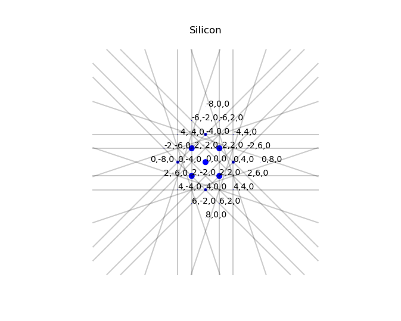

# Kinematic Diffraction Simulation Python Modules

## Overview
This python package contains python modules that simulates
diffraction with selected crystal. It contains the following featurespython modules:

>**pyemaps** : top level python module, containing many submodules designed for electron microscopic simulations

>**crystal** : crystal data module, classes and methods loading crystal data from various sources

>**dif** : Kinematic Diffraction module, generating diffraction patterns based on the crystal data and microscope and sample control parameters.  

All of the above python modules are based on propietory Fortran applications released as backend of cloudEMAPS2.0.

Future releases include:

>*Bloch* : dynamic bloch Diffraction Simulation (proprietory, license needed)

Check [our site](https://www.emlabsolutions.com) for updates and new features.

## Basic Usage:

```
from pyemaps import Crystal as cryst
from pyemaps import dif
```
## Example Run

The following diffraction plot is generated with silicon crystal data built in the package:

```
crystal Silicon: dw = iso
cell 5.4307 5.4307 5.4307 90 90 90
atom si 0.125 0.125 0.125 0.4668 1.00
spg 227 2
```

and default electron microscope and sample control parameters:

```
zone axis: (0,0,1)
microscope mode: normal
microcope camera length : 1000 nm
microscope voltage: 200
sample tilt: (0.0,0.0)
sample offset: (0.0,0.0)
spot size: 0.05 nm
```


