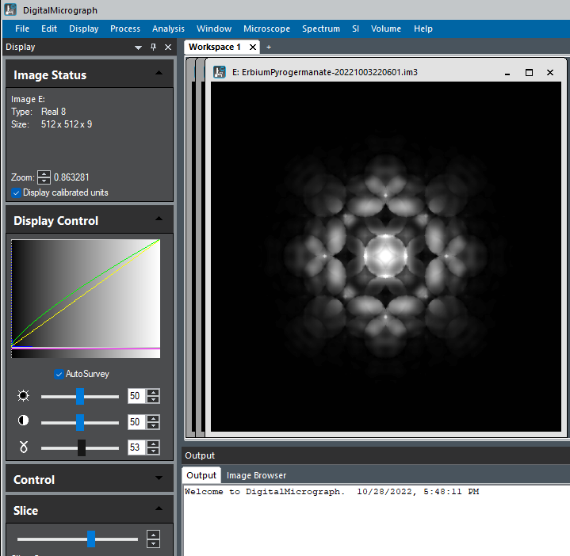

Visualisation
=============

*pyemaps* provides a set of helper functions to show diffraction patterns.
These function are implemented with python's *matplotlib*. 

*si_dif.py* and *si_bloch.py* sample code demonstrate the rendering of 
diffraction patterns generated for *silicon* crystal by plotting
its kikuchi lines, diffracted beams and HOLZ lines for kinematic 
simulation and showing the raw image in the case of Bloch simulation.

Users can also access diffraction patterns data directly and visualize
the pattern with third party tools such as `ImageJ <https://imagej.nih.gov/ij/>`_, 
`DigitalMicrograph <https://www.gatan.com/products/tem-analysis/gatan-microscopy-suite-software>`_.
as shown in :ref:`Rendering by Third Party Tools <thirdparty>`

Builtin Displays
----------------

Kinematic Diffraction Simulations
~~~~~~~~~~~~~~~~~~~~~~~~~~~~~~~~~
Additional example of *pyemaps*'s builtin functions for rendering 
kinematic diffraction simulations for *silicon* crystal with starting zone 
changing and camera length set at 2500:

.. image:: https://github.com/emlab-solutions/imagepypy/raw/main/dif_table.png
    :target: https://github.com/emlab-solutions/imagepypy/raw/main/dif_table.png

with the following sample code:

.. code-block:: python

        
    from pyemaps import DEF_CBED_DSIZE, DEF_MODE
    from pyemaps import EMC

    MAX_PROCWORKERS = 4

    def generate_difs(name = 'Silicon', mode = DEF_MODE):
        
        from pyemaps import DPList
        import concurrent.futures
        from pyemaps import Crystal as cryst

        cr = cryst.from_builtin(name)

        if mode == 2:
            dsize = DEF_CBED_DSIZE
        
        zlist=[(0,0,1), (1,1,2), (1,1,1),
               (1,3,3), (0,1,2), (0,1,3)]
        
        fs=[]

        difs = DPList(name, mode = mode)

        emclist =[EMC(zone=z, cl=2500) for z in zlist] 

        with concurrent.futures.ProcessPoolExecutor(max_workers=MAX_PROCWORKERS) as e:

            for ec in emclist:
                fs.append(e.submit(cr.generateDP, mode=mode,  dsize=dsize, em_controls = ec))

            for f in concurrent.futures.as_completed(fs):
                try:
                    emc, diffP = f.result()
                    difs.add(emc, diffP)
                    
                except Exception as e:
                    print(f'{f} generated an exception: {e}')
                    exit(1)
        difs.sort()
        return difs

    if __name__ == '__main__':
        
        from pyemaps import showDif

        dpl = generate_difs(mode = 2)
        showDif(dpl, cShow = True, iShow=True, layout='table', bSave = True)

Dynamic Diffraction Simulations
~~~~~~~~~~~~~~~~~~~~~~~~~~~~~~~

Below is another example of using *pyemaps* builtin display functions
to render Bloch simulation images for *silicon* with:

::

    zone=(1,1,1) 
    hight voltage vt=100
    sample thickness = (500, 1750, 250)
    (starting at 500, ending at 1750 with an increment of 250)
    sampling points: 40

.. image:: https://github.com/emlab-solutions/imagepypy/raw/main/bloch_table.png
    :target: https://github.com/emlab-solutions/imagepypy/raw/main/bloch_table.png

.. code-block:: python

    from pyemaps import EMC, DEF_CBED_DSIZE

    MAX_PROCWORKERS = 4

    def generate_bloch_images(name = 'Silicon', dsize = DEF_CBED_DSIZE, ckey = 'tilt'):
        
        from pyemaps import Crystal as cryst
        from pyemaps import SIMC

        cr = cryst.from_builtin(name)
        
        vt = 100
        sth = (500, 1750, 250)
        simc = SIMC(excitation=(0.3,1.0), bmin=0.1)
    
        try:
            bimgs = cr.generateBloch(sampling = 40,
                                    em_controls = EMC(zone=(1,1,1),
                                    vt=vt,
                                    cl=1000,
                                    simc=simc),
                                    sample_thickness = sth
                                    )
        except Exception as e:
                print(f'Generated an exception: {e}') 
                return None
                
        bimgs.sort()
        return bimgs 

    if __name__ == '__main__':
        
        from pyemaps import showBloch

        imgs = generate_bloch_images()
        if imgs is not None:
            showBloch(imgs, cShow=True, layout='table', bSave = True)

Stereodiagram
~~~~~~~~~~~~~

Similar build-in function to display stereodiagram output from *pyemaps*
is showStereo function in *pyemaps*'s *display* module. It takes a 
stereodiagram dictionary objects generated from *pyemaps*' 
`generateStereo <pyemaps.crystals.html#pyemaps.crystals.Crystal.generateStereo>`_
and renders each element by accessing the dictionary objects directly
as demonstrated below:

.. code-block:: python

    import concurrent.futures
    from pyemaps import EMC
    MAX_PROCWORKERS = 4

    def getStereo(cc, emc = EMC()):
        
        stereo = cc.generateStereo(zone = emc.zone)
        return emc, stereo
        
    def generate_stereo_list(name = 'Silicon'):  
        from pyemaps import Crystal as cr
        
        si = cr.from_builtin(name)
        emclist = []
        
        for i in range(-3,3): 
            emclist.append(EMC(zone=(i,-i,1)))
        
        fs = []
        slist=[]
        with concurrent.futures.ProcessPoolExecutor(max_workers=MAX_PROCWORKERS) as e:
            
            for ec in emclist:
                fs.append(e.submit(getStereo, si, emc=ec))

            for f in concurrent.futures.as_completed(fs):
                try:
                    emc, stereo = f.result()               
                except Exception as e:
                    print('failed to generate stereodiagram with ' + str(e))
                    exit(1)
                else:
                    slist.append((emc, stereo))    
        
        slist.sort(key=lambda x: x[0])
        return slist

    if __name__ == '__main__':
        
        from pyemaps import showStereo
        
        stereoList = generate_stereo_list()
        showStereo(stereoList, 
                name='Silicon', 
                cShow = True,
                iShow=True, 
                zLimit = 1,
                layout='table')

.. image:: https://github.com/emlab-solutions/imagepypy/raw/main/stereo_table.png
    :target: https://github.com/emlab-solutions/imagepypy/raw/main/stereo_table.png

Pyemaps GUI Web Service
~~~~~~~~~~~~~~~~~~~~~~~

Driven by the latest pyemaps, a web server is setup for those who are interested
in better visualization of pyemaps simulations and calculations. This service
is for a nominal subscription fees. Go to https://emaps.emlabsolutions.com
to sign up.

Below is an example of the ineractive 3-d display of atomic structure through Jmole
based on pyemaps crystal structure calculations:

.. image:: https://github.com/emlab-solutions/imagepypy/raw/main//pyemaps_web_server.png
    

.. _thirdparty:

Rendering by Third Party Tools
------------------------------

pyemaps kinematic diffraction simulation results are captured by 
`DP or diffPattern <pyemaps.kdiffs.html#pyemaps.kdiffs.diffPattern>`_ class:

.. code-block:: python
    
    from pyemaps import Crystal as cr
    
    si = cr.from_builtin('Silicon')

    _, dp = si.generateDP()

    dp.klines   # Kikuchi lines list
    dp.nklines  # number of Kikuchi lines, same as len(dp.klines)
    dp.disks    # diffracted beams list
    dp.ndisks   # number of diffracted beams, same as len(dp.disks)
    dp.hlines   # HOLZ lines list
    dp.nklines  # number of HOLZ lines, same as len(dp.hlines)

where dp.klines is a python list of `Line class <pyemaps.kdiffs.html#pyemaps.kdiffs.Line>`_ 
objects and dp.disks of `Disk class <pyemaps.kdiffs.html#pyemaps.kdiffs.Disk>`_ objects 
and so on. Each of the objects is accessible for its own data such as points when plotting.

Below is an exmaple of rendering a diffraction pattern generated for *Diamond* builtin crystal
in DigitalMicrograph:

.. code-block:: python

    def show_diffract(dp, md=1, name = 'Diamond'):
    
        shape = (2*XMAX*mult,2*YMAX*mult)

        #A new image from numpy array and initilize it to black background
        dif_raw = np.ones((shape), dtype = np.float32)
        dif_raw[:,:] = 255.0

        #DM create the image
        dm_dif_img = DM.CreateImage(dif_raw)
        dif_img = dm_dif_img.ShowImage()
        dif_img_disp = dm_dif_img.GetImageDisplay(0)
        
        #set image title
        img_title = str(f'Kinematic Diffraction Simulation:  {name} in {DIFF_MODE[md-1]} Mode')
        dm_dif_img.SetName(img_title)
        num_klines = dp.nklines
        if num_klines > 0:
            klines = dp.klines
            for kl in klines:        
                x1, y1, x2, y2 = kl 
                
                xx1, yy1, = (x1 + XMAX)*mult,(y1 + YMAX)*mult 
                xx2, yy2  = (x2 + XMAX)*mult,(y2 + YMAX)*mult
                
                kline = dif_img_disp.AddNewComponent(2, xx1, yy1, xx2, yy2)
                
                SetCommonProp(kline)
                kline.SetForegroundColor(0.7, 0.7, 0.7) #grey
                kline.SetBackgroundColor(0.2,0.2,0.5) # dark blue

        num_disks = dp.ndisks
        
        if num_disks > 0:
            disks = dp.disks
            for d in disks:
                x1, y1, r, i1, i2, i3 = d
                xx, yy, rr = (x1 + XMAX)*mult, (y1 + YMAX)*mult, r*mult
                            
                idx = '{:d} {:d} {:d}'.format(i1,i2,i3)
                
                disk = dif_img_disp.AddNewComponent(6, xx-rr, yy-rr, xx+rr, yy+rr)
                
                SetCommonProp(disk)
                disk.SetForegroundColor(0.0,0.0,1.0)  # blue
                disk.SetBackgroundColor(0.5,0.5,0.75) # dark blue
                if md == 1:
                    disk.SetFillMode(1)
                else:
                    disk.SetFillMode(2)
            
                indxannot0 = DM.NewTextAnnotation(0, 0, idx, 10)
                
                t, l, b, r = indxannot0.GetRect()
                w = r-l
                h = b-t
                
                nl = xx - ( w / 2)
                nt = yy -rr - h if md ==1 else yy - (h / 2)
                
                indxannot = DM.NewTextAnnotation(nl, nt, idx, 10)
                
                dif_img_disp.AddChildAtEnd(indxannot)
                SetCommonProp(indxannot)
                indxannot.SetForegroundColor(0.9,0,0) #light red
                indxannot.SetBackgroundColor(1,1,0.5)
                
        if md == 2:
            num_hlines = dp.nhlines
            if num_hlines > 0 :
                hlines = dp.hlines
                for hl in hlines:
                    x1, y1, x2, y2 = hl
                    xx1, yy1 = (x1 + XMAX)*mult, (y1 + YMAX)*mult 
                    xx2, yy2 = (x2 + XMAX)*mult, (y2 + YMAX)*mult
                    
                    hline = dif_img_disp.AddNewComponent(2, xx1, yy1, xx2, yy2)
                    SetCommonProp(hline)
                    hline.SetForegroundColor(0,0,0.8)
                    hline.SetBackgroundColor(0.2,0.2,0.5)    # dark blue
                    
        del dm_dif_img
        return 0        

where *dp* is the kinematic diffraction pattern generated from generateDP call.

.. note:: 

    To get the above display work in *DM*, *pyemaps* must be installed in *DM*'s 
    python environment.

Dynamic Diffraction Patterns
~~~~~~~~~~~~~~~~~~~~~~~~~~~~

The output from bloch dynamic diffraction simulation is an array of 2 or 3 dimensional floating
numbers representing image intensities, depending on whether one or multiple slices of 
dynamic diffraction images are generated. 

**pyemaps** provides an option for users to save the images as raw image files that
can be imported into ImageJ or DigitalMicrograph. Refer to 
`generateBloch <pyemaps.crystals.html#pyemaps.crystals.Crystal.generateBloch>`_ or
`getBlochImages <pyemaps.crystals.html#pyemaps.crystals.Crystal.getBlochImages>`_ for
details.

Below is a visualization of a raw bloch images files saved from a pyemaps dynamic simulation
run in Digita;Micrograph. The raw image contains 10 images each at a sample thickness 
range betwwen 0 and 1000.

    

Constructing Crystal
~~~~~~~~~~~~~~~~~~~~

*pyemaps*' `generateMxtal <pyemaps.crystals.html#pyemaps.crystals.Crystal.generateMxtal>`_
function produces .XYZ file that can be improted into 
`Jmole <http://www.jmol.org/>`_ and visualize the 
crystal in 3D atomic structure. The following is an example of such rendering:

.. image:: https://github.com/emlab-solutions/imagepypy/raw/main/mxtal01.png

